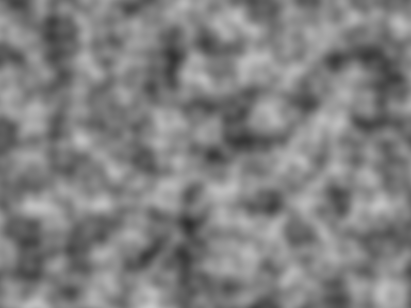

# Perlin Noise



## Features

* Simple implementation of the Perlin noise algorithm in 1D, 2D, and 3D.
* Pure C++11 without any dependencies on standard or external libraries.
* Templated functions with specializations for `float` and `double` data types.
* An [stb][0]-style single-header library that can be easily included into any project.
* Support for WebAssembly compilation through [Emscripten bindings](./db_perlin_wasm.hpp).
* Interactive [web demonstration](https://daniilsjb.github.io/perlin-noise/) with sliders, zooming and panning.
* Example of writing a noise gradient to a [simple bitmap file](./examples/bmp/main.cpp).

## About

I wrote this with the primary goal of having a bit of fun and learning more about the famous algorithm used everywhere
in procedural generation. Ultimately, my goal was to use this implementation in several other projects (it's always good
to have a noise generator lying around). I hope it could be useful to other people, too!

## Usage

If you're familiar with [stb][0] libraries, there is nothing new to learn here: simply copy the entire [`db_perlin.hpp`](./db_perlin.hpp)
file somewhere in your project and provide exactly one definition of `DB_PERLIN_IMPL` in a source file before including
the header. This will typically look like this:

```cpp
#define DB_PERLIN_IMPL
#include "db_perlin.hpp"
```

Optionally, you may generate [Emscripten][1] bindings if you would like to use the noise functions in your JavaScript applications.
Simply include the [`db_perlin_wasm.hpp`](./db_perlin_wasm.hpp) header alongside the implementation before compiling the library to
a WASM module:

```cpp
#define DB_PERLIN_IMPL
#include "db_perlin.hpp"
#include "db_perlin_wasm.hpp"
```

To only get the declarations of the noise functions without the underlying implementation, simply include the header file without
the implementation definition. You may now call the noise functions in whatever way you'd like:

```cpp
#include "db_perlin.hpp"

int main() {
    double x = /* ... */;
    double y = /* ... */;
    double z = /* ... */;

    double noise1D = db::perlin(x);
    double noise2D = db::perlin(x, y);
    double noise3D = db::perlin(x, y, z);
}
```

Depending on your needs and preferences, you may either place the implementation of the library in a dedicated source file or embed
it directly into another source file that uses the library. See the [examples](./examples) directory for details.

## References

* https://mrl.cs.nyu.edu/~perlin/noise/
* https://flafla2.github.io/2014/08/09/perlinnoise.html
* https://github.com/nothings/stb/blob/master/stb_perlin.h
* https://github.com/stegu/perlin-noise/blob/master/src/noise1234.c

[0]: <https://github.com/nothings/stb>
[1]: <https://emscripten.org/>
