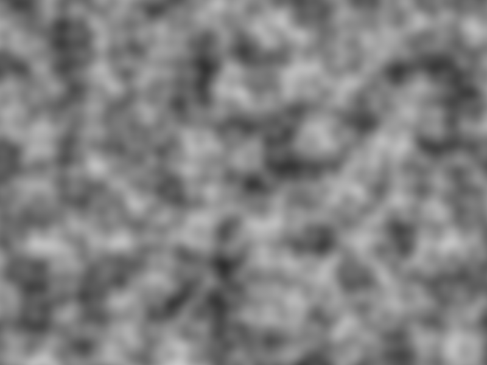

# Perlin Noise



## About

Quick and simple implementation of Perlin Noise algorithm in 1D, 2D, and 3D in C++ with no external dependencies. This
code may easily be reused by simply including the header into any project along with a `DB_PERLIN_IMPL` definition. All
relevant code is written as a small set of pure functions that work with both floats and doubles.

I wrote this with the primary goal of having a bit of fun and learning more about the famous algorithm used everywhere
in procedural generation. Ultimately, my goal was to use this implementation in several other projects (it's always good
to have a noise generator lying around). I hope it could be useful to other people, too!

## Usage

If you're familiar with stb libraries, there is nothing new to learn here: simply copy the entire `db_perlin.hpp` file
somewhere in your project and provide exactly one definition of `DB_PERLIN_IMPL` in a source file before including
the header. You may create a dedicated file to serve as the implementation:

```cpp
// file: db_perlin.cpp

#define DB_PERLIN_IMPL
#include "db_perlin.hpp"
```

Then you may use it from other files as you normally would any header file:

```cpp
// file: main.cpp

#include "db_perlin.hpp"

int main() {
    float x = /* ... */;
    float y = /* ... */;
    float z = /* ... */;
    
    float noise1D = db::noise(x);
    float noise2D = db::noise(x, y);
    float noise3D = db::noise(x, y, z);
}
```

If you only need to use the library once you may avoid creating a dedicated implementation file and treat your program
source as the implementation:

```cpp
// file: main.cpp

#define DB_PERLIN_IMPL
#include "db_perlin.hpp"

int main() {
    float x = /* ... */;
    float y = /* ... */;
    float z = /* ... */;
    
    float noise1D = db::noise(x);
    float noise2D = db::noise(x, y);
    float noise3D = db::noise(x, y, z);
}
```

## Demo

A more detailed example is provided with in this repository in [demo.cpp](demo.cpp) file. It is a small demonstration
written with [SFML](https://www.sfml-dev.org/) that displays the 3D noise as an animated grayscale with respect to time.
